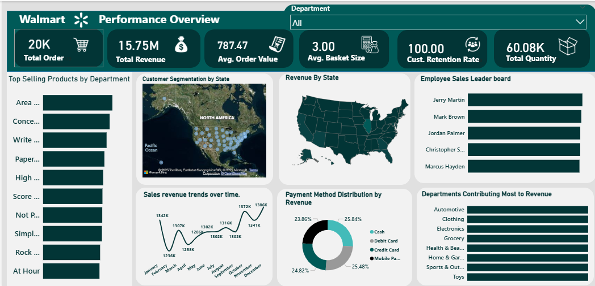

#  
This project follows a full end-to-end analytics workflow, beginning from dataset exploration and SQL analysis, and ending with an interactive, insight-driven Power BI dashboard.

1. Initial Data Understanding (Excel Exploration)

The project began by reviewing the dataset provided in Excel format.
I explored the structure of the fields, identified key columns (sales, product, employee, department, location), and gained preliminary understanding of what types of analysis would be required.

This step allowed me to understand relationships and prepare for deeper querying in SQL.

2. Database Setup (MySQL Workbench)

The dataset also included a Walmart SQL dump file, which contained pre-built tables such as:

* sales
* products
* departments
* employees

I loaded this SQL file into MySQL Workbench, where it automatically created the database schema and populated it with records.

After confirming the table structure using:

SHOW TABLES;

I proceeded to write analytics-driven SQL queries.

3. SQL Analysis — Extracting Business Insights

In MySQL, I created all analytical queries needed to answer the project questions.
This included:

 KPI Metrics

* Total Orders

* Total Revenue

* Avg. Order Value

* Avg. Basket Size

* Customer Retention Rate

* Total Quantity Sold

Dashboard Visuals
# Top-selling products

# Departments Contributing Most to Revenue

Price vs. quantity relationships  

# Customer Insights

Active customer count by day, week, month

Town/state purchase patterns

State-level revenue distribution

# Revenue by State

# Employee Sales Leaderboard

# Sales Trend Analysis

Daily sales quantity & revenue

Weekly sales trends

Monthly sales patterns

# Payment Method Analysis

I connected Power BI directly to MySQL Workbench using the MySQL database connector.

I loaded the relevant tables (sales, products, departments, employees) — not the individual query results
because Power BI can recreate the measures dynamically using DAX or by using Power Query transformations.

Once the connection succeeded, it shows a  relationships using:

product_id

employee_id

department_id

customer_id

5. DAX Measures Created in Power BI

To support KPI visualization, I created essential DAX measures:

# Total Orders = COUNT(Sales[sale_id])

# Total Revenue = SUMX(Sales, Sales[quantity] * Related(Products[price]))

# Average Order Value = [Total Revenue] / [Total Orders]

# Total Quantity Sold

Total Quantity = SUM(Sales[quantity])

Avg Basket Size = AVERAGE(Sales[quantity])

# Customer Retention Rate
(calculated by returning customers vs new customers)

Revenue % by Department or Payment Method
Revenue % = DIVIDE([Total Revenue], CALCULATE([Total Revenue], ALL(Sales)))

These measures powered the KPIs and charts in the dashboard.

6. Building the Power BI Dashboard

The dashboard covered all expected insights:

Main KPIs
# Total Orders

# Total Revenue

# Average Order Value

# Average Basket Size

# Customer Retention Rate

Visuals

# Sales Revenue Trend (Line chart — revenue over time)

# Top Selling Products (Bar chart)

# Best-Performing Departments (Column chart)

# Payment Method Distribution (Donut chart)

# Revenue by State (Shape map)

# Customer Segmentation by Town/State (Filled map)

# Employee Sales Leaderboard (Donut chart)

Geospatial Insights

* The Map visual Customer Segmentation by state.

* The Shape Map reflected state boundaries using shading intensity.

7. Final Output

Recommendations

Optimize inventory for high-demand products to prevent stockouts and overstock.

Promote underperforming products and departments to boost revenue.

Run targeted campaigns in low-activity regions to improve customer engagement.

Incentivize and monitor employee performance to increase productivity.

Adjust pricing strategies for low-selling items to improve sales.
